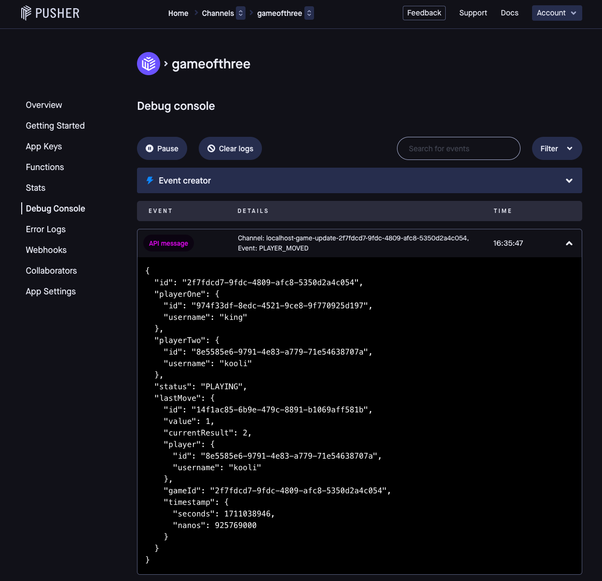

# Game of Three
The "Game of Three" is a simple multiplayer arithmetic game where players aim to reach the number 1 through a series of divisions by 3. Players take turns to input a number, which is then divided by 3. The result is rounded to the nearest integer, and the resulting number becomes the next player's input. Players are allowed to input -1, 0, or 1 after the initial input to ensure the game progresses smoothly.

## Implementation Details

The service is a hybrid of HTTP and Websocket.

Game updates are sent via websocket (pusher.com service) to the UI. This is to prevent players keep polling to check if it's their turn to play.
There are 2 types of websocket messages. One is to inform the other player that a player has joined the game and the other one to inform that the other player has moved/played.

Starting and moving in the game is done via HTTP POST requests.

This hybrid mechanism has made the implementation easier.


## Endpoints

Here is the Swagger documentation:

[Swagger endpoint](http://localhost:8080/swagger-ui/index.html)

Endpoint POST ``/games`` does two things, either it starts a new game or when a 2nd player wants to start a game he/she automatically joins an existing game which is in `WAITING` state that has been already created by another player.
Ideally it would be better to have an extra endpoint to `join` an existing game or create a new game, however for simplicity and due to time constraints that has been skipped.


## Tests

As many tests as possible have been tried to be put, however most important aspects of the code are being covered by the tests, and the coverage is not 100% due to time constraint.

Integration tests have the naming convention to end with `*IT.java` and unit tests have the naming convention to end with `*Test.java`.

When running tests, ensure that the docker dependencies are active by executing `./start-deps.sh`.

## Starting the application

Initially, execute `./start-deps.sh` to initiate the dependencies.

To terminate the dependencies, use the command `./stop-deps.sh`.

To run the application via Maven, run the following commands:
```
./mvnw clean install
./mvnw spring-boot:run
```
To run the application locally via intelliJ, add these `VM Options` to the configuration:
```
--add-opens java.base/java.lang=ALL-UNNAMED
--add-opens java.base/java.time=ALL-UNNAMED
```

## Tech Stack

- Spring boot 3.x
- Java 17
- Postgres
- Redis
- docker
- pusher.com (external Websocket service)

## Future Development

- Sending metrics of failures/successes
- More test coverage
- Workflow diagram
- Handling when a player gets disconnected
- Players can have statistics of their wins/loses
- Security for authenticating players

## Sample outputs

Here is the sample response when a game starts:
```
 {
    "id": "5ff4b6b4-b246-4825-8ce8-6bc2aba847c7",
    "playerOne": {
        "id": "8e5585e6-9791-4e83-a779-71e54638707a",
        "username": "king"
    },
    "playerTwo": null,
    "status": "WAITING",
    "lastMove": null,
    "winner": null
}
```
Here is the sample response when a player wins:

```
{
    "id": "5ff4b6b4-b246-4825-8ce8-6bc2aba847c7",
    "playerOne": {
        "id": "8e5585e6-9791-4e83-a779-71e54638707a",
        "username": "kooli"
    },
    "playerTwo": {
        "id": "974f33df-8edc-4521-9ce8-9f770925d197",
        "username": "king"
    },
    "status": "FINISHED",
    "lastMove": {
        "id": "da7da67b-6901-4a6e-9a57-afbf7c75981c",
        "value": 1,
        "currentResult": 1,
        "player": {
            "id": "974f33df-8edc-4521-9ce8-9f770925d197",
            "username": "king"
        },
        "gameId": "5ff4b6b4-b246-4825-8ce8-6bc2aba847c7",
        "timestamp": "2024-03-21T16:15:00.831830Z"
    },
    "winner": {
        "id": "974f33df-8edc-4521-9ce8-9f770925d197",
        "username": "king"
    }
}
```
Sample message sent via pusher:


